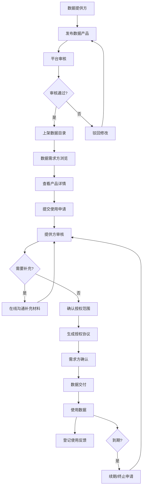

## 1. 产品概述

数据要素流通平台 Web 门户是一个面向数据提供方、数据需求方和平台运营方的综合性数据交易与管理平台。平台解决数据资产流通中的供需对接、授权管控、交易追踪和质量反馈等核心问题，促进数据要素合规、高效、安全地流通。

- 核心目标：构建可信的数据要素流通生态，实现数据产品的发布、筛选、申请、授权、交易全流程闭环管理
- 市场价值：赋能各行业数据要素市场化配置，提升数据资产价值，推动数字经济发展

## 2. 核心 Features

### 2.1 用户角色

| 角色 | 注册方式 | 核心权限 |
|------|----------|----------|
| 数据提供方 | 企业认证注册 | 发布数据产品、管理授权、查看交易记录、处理申请 |
| 数据需求方 | 企业认证注册 | 浏览数据目录、申请使用、管理授权、提交评价 |
| 平台运营方 | 后台账号 | 上架审核、成交统计、用户管理、平台配置 |

### 2.2 Feature Module

1. **数据目录**：多维度筛选、数据产品列表、搜索功能、收藏管理
2. **产品详情**：产品信息展示、数据样例、质量说明、规格定价、收藏按钮、申请入口
3. **申请流程**：使用目的说明、使用期限选择、补充材料上传、在线沟通、提交申请
4. **授权管理**：授权范围确认、审批状态跟踪、授权记录查看
5. **交易记录**：交付记录查看、续期申请、终止申请、交易详情
6. **评价中心**：使用反馈登记、评分系统、评价列表、数据质量反馈
7. **运营后台**：上架审核、成交统计、数据概览

### 2.3 Page Details

| 页面名称 | 模块名称 | Feature description |
|----------|----------|---------------------|
| 数据目录 | 筛选面板 | 按行业、地区、更新频率多维度筛选，支持关键词搜索 |
| 数据目录 | 产品列表 | 卡片式展示产品信息，包含封面、名称、提供方、价格、标签 |
| 数据目录 | 收藏功能 | 一键收藏/取消收藏，查看我的收藏列表 |
| 产品详情 | 基本信息 | 产品名称、描述、提供方信息、更新频率、数据覆盖范围 |
| 产品详情 | 数据样例 | 预览结构化样例数据，字段说明展示 |
| 产品详情 | 质量说明 | 数据完整性、准确性、时效性评分，质量报告 |
| 产品详情 | 规格定价 | 不同授权类型对应的价格和使用期限 |
| 申请流程 | 申请表单 | 使用目的、使用场景、使用期限、数据量级需求 |
| 申请流程 | 在线沟通 | 与数据提供方实时沟通，补充材料上传 |
| 申请流程 | 提交确认 | 申请信息预览、协议确认、提交申请 |
| 授权管理 | 授权列表 | 待审批、已授权、已拒绝的申请列表 |
| 授权管理 | 授权审批 | 查看申请详情、确认授权范围、审批操作 |
| 授权管理 | 状态跟踪 | 审批进度可视化展示、消息通知 |
| 交易记录 | 交付记录 | 数据交付时间、交付方式、使用期限 |
| 交易记录 | 续期管理 | 发起续期申请、选择新期限、费用计算 |
| 交易记录 | 终止管理 | 发起终止申请、原因说明、确认终止 |
| 评价中心 | 反馈表单 | 数据质量评分、使用体验、改进建议 |
| 评价中心 | 评价列表 | 历史评价记录、评分统计 |
| 运营后台 | 上架审核 | 待审核产品列表、审核操作、驳回原因 |
| 运营后台 | 成交统计 | 交易金额、交易量、热门产品、趋势图表 |

## 3. 核心流程

### 3.1 数据产品发布与上架流程
数据提供方填写产品信息 → 提交发布申请 → 平台运营方审核 → 审核通过后上架至数据目录 → 需求方可浏览申请

### 3.2 数据产品申请与授权流程
需求方浏览数据目录 → 查看产品详情 → 提交使用申请 → 提供方审核申请 → 双方在线沟通补充材料 → 提供方确认授权范围 → 平台生成授权协议 → 需求方确认 → 数据交付

### 3.3 数据使用与反馈流程
需求方获取数据 → 使用数据 → 登记使用反馈和评价 → 提供方查看评价并改进 → 到期前可申请续期或终止

## 4. 用户界面设计

### 4.1 设计风格
- **主色调**：深海蓝 (#0F3460) 作为主色，代表专业、可信、科技感
- **辅助色**：青绿色 (#16C79A) 作为强调色，代表数据、流通、活力
- **中性色**：深灰 (#1A1A2E)、中灰 (#535464)、浅灰 (#F5F7FA)、白色 (#FFFFFF)
- **警示色**：橙色 (#FF9F43) 用于警告，红色 (#EE5A6F) 用于错误，绿色 (#10B981) 用于成功
- **按钮风格**：圆角 8px，微阴影，hover 时有轻微上浮效果
- **字体**：标题使用 "Noto Sans SC"，正文使用 "PingFang SC"，追求清晰专业
- **布局风格**：卡片式布局，顶部导航 + 左侧菜单，适当留白，层次分明
- **图标风格**：线性图标，粗细 1.5px，保持统一风格

### 4.2 页面设计概述

| 页面名称 | 模块名称 | UI Elements |
|----------|----------|-------------|
| 数据目录 | 筛选面板 | 左侧固定面板，标签式筛选选项，折叠/展开动画 |
| 数据目录 | 产品列表 | 响应式网格布局，卡片悬停动效，收藏按钮动画 |
| 产品详情 | 顶部区域 | 产品名称 + 标签 + 提供方信息，背景渐变效果 |
| 产品详情 | Tab 导航 | 产品介绍、数据样例、质量说明、规格定价切换 |
| 产品详情 | 数据样例 | 表格展示样例数据，代码块展示字段结构 |
| 申请流程 | 步骤指示器 | 水平时间轴，已完成步骤高亮，当前步骤动画 |
| 申请流程 | 表单区域 | 分组表单，输入框焦点动效，实时校验反馈 |
| 申请流程 | 在线沟通 | 聊天式界面，消息气泡，上传区域拖拽效果 |
| 授权管理 | 状态标签 | 不同状态使用不同颜色徽章，进度条动画 |
| 交易记录 | 时间线 | 垂直时间轴展示交易历程，交付记录卡片 |
| 评价中心 | 评分组件 | 星星评分交互，滑杆满意度评分 |
| 运营后台 | 统计图表 | 柱状图、折线图、饼图，数据加载动画 |
| 运营后台 | 数据表格 | 可排序、可筛选、可分页的数据表 |

### 4.3 响应性
- **设计优先**：Desktop-first 设计，1920px 为基准设计宽度
- **断点设置**：1440px、1280px、1024px、768px、480px
- **移动端适配**：小于 768px 时，左侧菜单转为底部 Tab 或抽屉式菜单
- **触摸优化**：移动端按钮最小尺寸 44x44px，增加触摸反馈

### 4.4 动效设计
- **页面切换**：淡入淡出 + 轻微位移动画，时长 300ms
- **列表加载**：骨架屏加载，数据加载完成后渐入
- **交互反馈**：按钮 hover 上移 2px，阴影加深；click 时轻微缩放
- **状态变化**：状态徽章切换时的弹性动画
- **滚动效果**：导航栏滚动时背景透明度变化
- **数据可视化**：图表加载时的数据渐入动画
