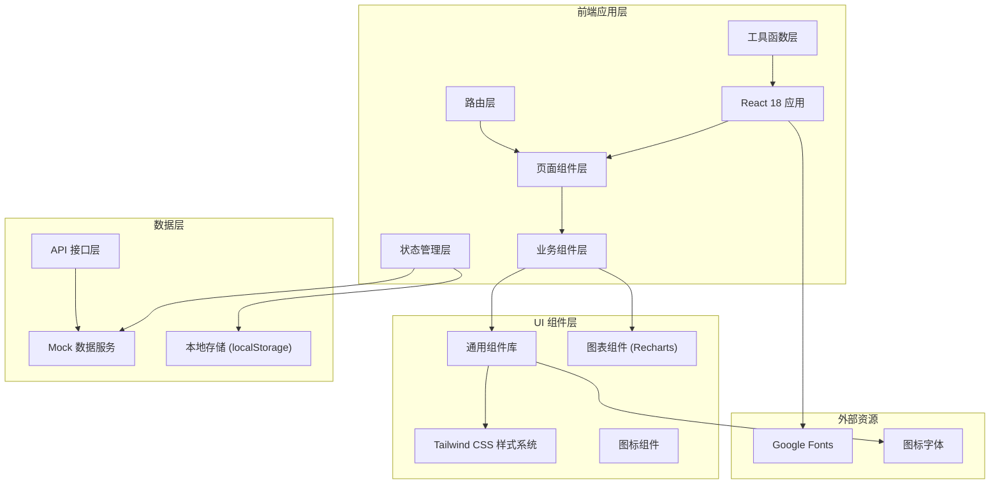
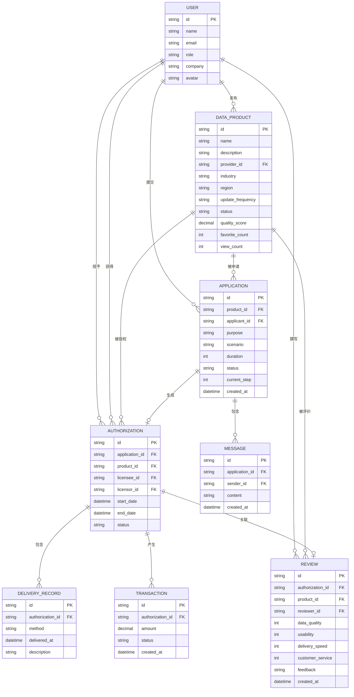

## 1. 架构设计



## 2. 技术描述

- **前端框架**：React@18 + TypeScript@5
- **构建工具**：Vite@5
- **路由管理**：React Router DOM@6
- **状态管理**：Zustand@4（轻量级状态管理）
- **样式方案**：Tailwind CSS@3 + PostCSS + Autoprefixer
- **UI 组件**：Headless UI（无样式组件库）+ 自定义组件
- **图表库**：Recharts@2
- **图标库**：Lucide React
- **表单处理**：React Hook Form@7 + Zod（表单校验）
- **数据模拟**：MSW (Mock Service Worker) / 本地 Mock 数据
- **代码规范**：ESLint + Prettier

## 3. 路由定义

| 路由路径 | 页面名称 | 权限要求 | 说明 |
|----------|----------|----------|------|
| / | 数据目录 | 公开 | 数据产品列表、筛选、搜索 |
| /product/:id | 产品详情 | 公开 | 产品信息、样例、质量说明、收藏 |
| /apply/:id | 申请流程 | 登录用户 | 申请表单、在线沟通、提交确认 |
| /authorizations | 授权管理 | 登录用户 | 授权列表、审批、状态跟踪 |
| /transactions | 交易记录 | 登录用户 | 交付记录、续期、终止管理 |
| /reviews | 评价中心 | 登录用户 | 反馈表单、评价列表 |
| /admin/review | 上架审核 | 运营方 | 待审核产品、审核操作 |
| /admin/statistics | 成交统计 | 运营方 | 交易统计、数据图表 |
| /login | 登录页 | 公开 | 用户登录、角色选择 |
| * | 404 页面 | 公开 | 未找到页面 |

## 4. API 定义（Mock 数据层）

### 4.1 TypeScript 类型定义

```typescript
// 数据产品类型
interface DataProduct {
  id: string;
  name: string;
  description: string;
  provider: {
    id: string;
    name: string;
    avatar: string;
  };
  category: string;
  industry: string;
  region: string;
  updateFrequency: 'daily' | 'weekly' | 'monthly' | 'quarterly' | 'yearly';
  tags: string[];
  coverImage: string;
  sampleData: SampleData;
  qualityScore: QualityScore;
  pricing: PricingTier[];
  status: 'draft' | 'pending' | 'published' | 'rejected';
  createdAt: string;
  updatedAt: string;
  favoriteCount: number;
  viewCount: number;
}

interface SampleData {
  fields: Field[];
  rows: Record<string, any>[];
}

interface Field {
  name: string;
  type: string;
  description: string;
}

interface QualityScore {
  completeness: number;
  accuracy: number;
  timeliness: number;
  overall: number;
  report: string;
}

interface PricingTier {
  id: string;
  name: string;
  duration: number; // 天数
  price: number;
  description: string;
  features: string[];
}

// 申请类型
interface Application {
  id: string;
  productId: string;
  productName: string;
  applicantId: string;
  applicantName: string;
  providerId: string;
  purpose: string;
  scenario: string;
  duration: number;
  dataScale: string;
  supplementaryMaterials: Material[];
  status: 'pending' | 'reviewing' | 'approved' | 'rejected' | 'communicating';
  currentStep: number;
  steps: ApplicationStep[];
  messages: Message[];
  authorizationScope?: AuthorizationScope;
  createdAt: string;
  updatedAt: string;
}

interface ApplicationStep {
  id: number;
  name: string;
  status: 'completed' | 'current' | 'pending';
  completedAt?: string;
}

interface Material {
  id: string;
  name: string;
  url: string;
  uploadedBy: string;
  uploadedAt: string;
}

interface Message {
  id: string;
  senderId: string;
  senderName: string;
  senderRole: 'provider' | 'applicant' | 'admin';
  content: string;
  attachments?: Material[];
  createdAt: string;
}

interface AuthorizationScope {
  dataRange: string;
  usageLimitations: string[];
  permittedPurposes: string[];
  dataSecurity: string;
}

// 授权记录类型
interface Authorization {
  id: string;
  applicationId: string;
  productId: string;
  productName: string;
  licenseeId: string;
  licenseeName: string;
  licensorId: string;
  licensorName: string;
  scope: AuthorizationScope;
  startDate: string;
  endDate: string;
  status: 'active' | 'expired' | 'terminated' | 'renewing';
  deliveryRecords: DeliveryRecord[];
  createdAt: string;
}

interface DeliveryRecord {
  id: string;
  method: 'api' | 'download' | 'sftp' | 'manual';
  deliveredAt: string;
  deliveredBy: string;
  description: string;
}

// 交易记录类型
interface Transaction {
  id: string;
  authorizationId: string;
  productId: string;
  productName: string;
  buyerId: string;
  buyerName: string;
  sellerId: string;
  sellerName: string;
  amount: number;
  duration: number;
  status: 'completed' | 'refunded' | 'pending';
  createdAt: string;
}

// 评价类型
interface Review {
  id: string;
  authorizationId: string;
  productId: string;
  productName: string;
  reviewerId: string;
  reviewerName: string;
  ratings: {
    dataQuality: number;
    usability: number;
    deliverySpeed: number;
    customerService: number;
    overall: number;
  };
  feedback: string;
  suggestions: string;
  createdAt: string;
}

// 用户类型
interface User {
  id: string;
  name: string;
  email: string;
  role: 'provider' | 'applicant' | 'admin';
  company: string;
  avatar: string;
  phone: string;
}

// 统计数据类型
interface Statistics {
  totalProducts: number;
  totalTransactions: number;
  totalAmount: number;
  totalUsers: number;
  monthlyTrend: { month: string; transactions: number; amount: number }[];
  topProducts: { productId: string; productName: string; count: number }[];
  categoryDistribution: { category: string; count: number }[];
  regionDistribution: { region: string; count: number }[];
}
```

### 4.2 接口列表

| 接口路径 | 方法 | 说明 |
|----------|------|------|
| /api/products | GET | 获取数据产品列表（支持筛选） |
| /api/products/:id | GET | 获取产品详情 |
| /api/products/favorites | GET | 获取收藏列表 |
| /api/products/:id/favorite | POST | 收藏/取消收藏产品 |
| /api/products/:id/applications | POST | 提交使用申请 |
| /api/applications | GET | 获取申请列表 |
| /api/applications/:id | GET | 获取申请详情 |
| /api/applications/:id/messages | POST | 发送消息 |
| /api/applications/:id/approve | POST | 审批通过 |
| /api/applications/:id/reject | POST | 审批拒绝 |
| /api/authorizations | GET | 获取授权列表 |
| /api/authorizations/:id/renew | POST | 发起续期申请 |
| /api/authorizations/:id/terminate | POST | 发起终止申请 |
| /api/transactions | GET | 获取交易记录 |
| /api/reviews | GET | 获取评价列表 |
| /api/reviews | POST | 提交评价 |
| /api/admin/products/pending | GET | 获取待审核产品 |
| /api/admin/products/:id/review | POST | 审核产品 |
| /api/admin/statistics | GET | 获取成交统计数据 |
| /api/auth/login | POST | 用户登录 |
| /api/auth/user | GET | 获取当前用户信息 |

## 5. 数据模型

### 5.1 ER 图



### 5.2 Mock 数据说明

所有数据使用本地 Mock 数据，存储在 `src/mock/` 目录下：
- `products.ts` - 数据产品 Mock 数据（20+ 条）
- `applications.ts` - 申请记录 Mock 数据
- `authorizations.ts` - 授权记录 Mock 数据
- `transactions.ts` - 交易记录 Mock 数据
- `reviews.ts` - 评价数据 Mock 数据
- `users.ts` - 用户 Mock 数据
- `statistics.ts` - 统计数据 Mock 数据

### 5.3 状态管理设计

使用 Zustand 管理全局状态：
- `useAuthStore` - 用户认证状态
- `useProductStore` - 数据产品列表、筛选条件、收藏状态
- `useApplicationStore` - 申请列表、申请详情、消息列表
- `useAuthorizationStore` - 授权列表、授权详情
- `useTransactionStore` - 交易记录
- `useReviewStore` - 评价数据
- `useAdminStore` - 运营后台数据
